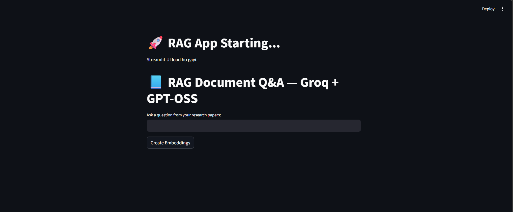
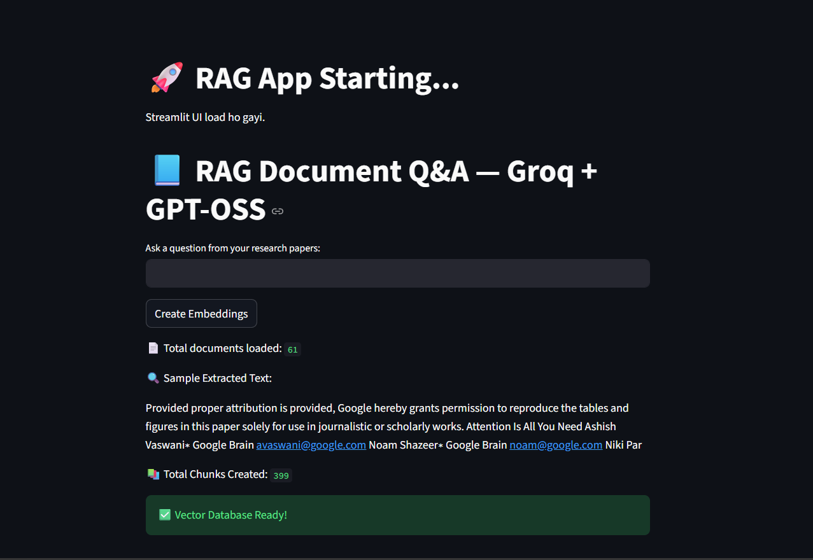
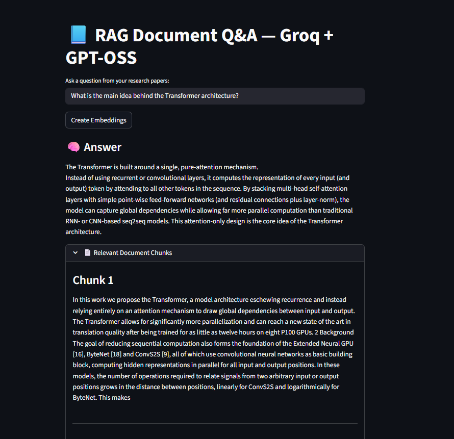

# RAG-Based Document Question Answering System

A Retrieval-Augmented Generation (RAG) application that allows users to upload documents and ask questions based on their content.

## Features

- Upload documents
- Document text processing
- Vector-based document retrieval
- Context-aware question answering
- LLM-powered responses
- Interactive Streamlit interface

## Tech Stack

- Python
- Streamlit
- LangChain
- Llama
- Groq
- OpenAI Embeddings
## Screenshots

### Application Interface



### Embeddings & Vector Database



### Question Answering



### Application Interface


### Document Upload


### Question Answering


## How to Run

```bash
pip install -r requirements.txt
streamlit run app.py